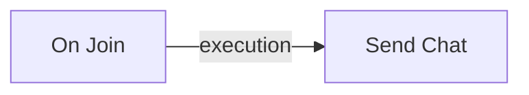

## Before you start

Complete [Connect your first bot](/docs/start-here/gui-mode).
Keep `DocsBot_1` stopped in `Docs tutorial`.
Keep the Minecraft console or a normal player open to observe chat.
Use a backend with the node types listed in the [node reference](/docs/scripting/node-reference).

## Create the graph

1. Open **Scripts** in the tutorial instance.
2. Create a script named `Tutorial greeting`.
3. Add an **On Join** trigger.
4. Add a **Send Chat** action.
5. Connect **On Join: Out** to **Send Chat: In** with an execution wire.
6. Set **Send Chat: Message** to `Hello from the visual script`.
7. Save the script and enable it by clearing its paused state.

The graph is:

The join trigger supplies the bot in execution context.
The Send Chat bot input is an optional override, so this graph needs no separate bot wire.

Alternatively, [download the same graph](/docs/scripts/join-greeting.soulfire-script.json) and import it with the editor toolbar.
Review the graph and save it after import. The download starts paused.

## Run and verify

Start `DocsBot_1` from **Overview**.
Expect one `Hello from the visual script` message after the bot joins.
A reconnect fires the join trigger again. This is one greeting per join, not once for the account's lifetime.

If no message appears, open the execution logs and inspect the saved graph.
Check the script's paused state, execution wire, message, and the bot's connected state.
Use [script debugging](/docs/scripting/debugging) for the next diagnostic step.

## Stop the behavior

Pause the script and save it.
Stop `DocsBot_1`, then start it once more.
Expect no tutorial greeting from the paused script.
Stop the bot again after the check.

## Extend the graph

Read [execution and data](/docs/scripting/execution-and-data) before adding a condition or a timer.
Try the [join-log recipe](/docs/scripting/recipes) to observe the event without sending Minecraft chat.
